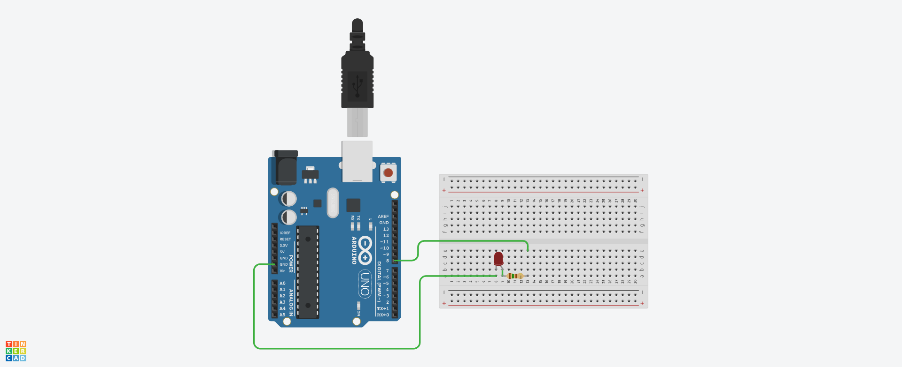
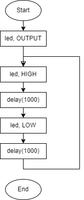
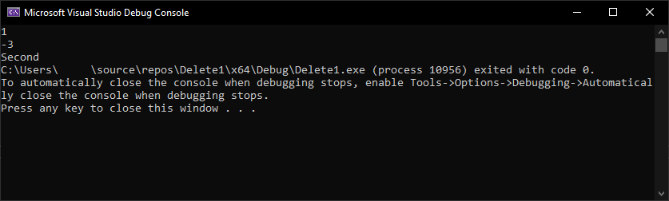

# Отчет №*
## Имя Фамилия
### Группа 83*0

[Ссылка на проект.](https://www.tinkercad.com/)



## Листинг программы
```C++
int led = 8; 
void setup() {
pinMode(led, OUTPUT); // установка 8-го контакта в режим вывода
}

void loop() {

digitalWrite(led, HIGH); // вывод №8 в активное состояние 
digitalWrite(led, LOW); // вывод №8 в неактивное состояние 
delay(1000); // пауза 1-секунда
delay(200);
}

```

## Блок-схема


## Пояснение
Мое пояснение к программе, схеме

## Листинг прошлых заданий
```C++
#include <iostream>
using namespace std;

int main()
{
    int x, y;
    cin >> x;
    cin >> y;
    if (x > 0 && y > 0)
    {
        cout << "First";
    }
    else if (x > 0 && y < 0)
    {
        cout << "Second";
    }
    else if (x < 0 && y < 0)
    {
        cout << "Third";
    }
    else if (x < 0 && y>0)
    {
        cout << "Fourth";
    }
}
```
## Результат выполнения программы


